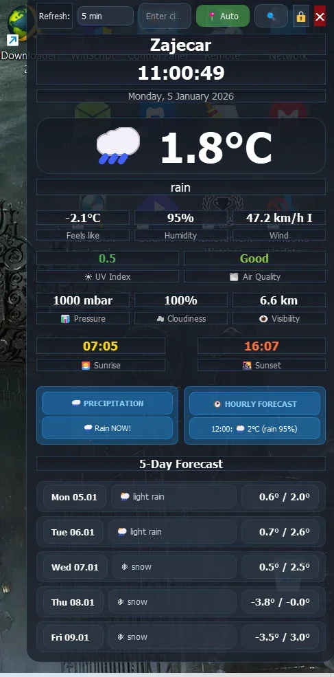
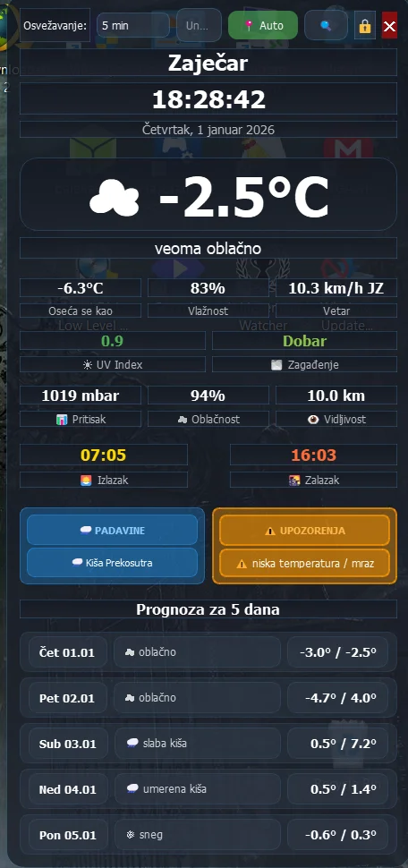
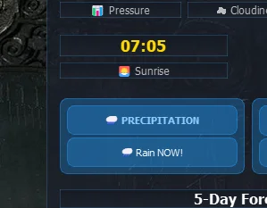
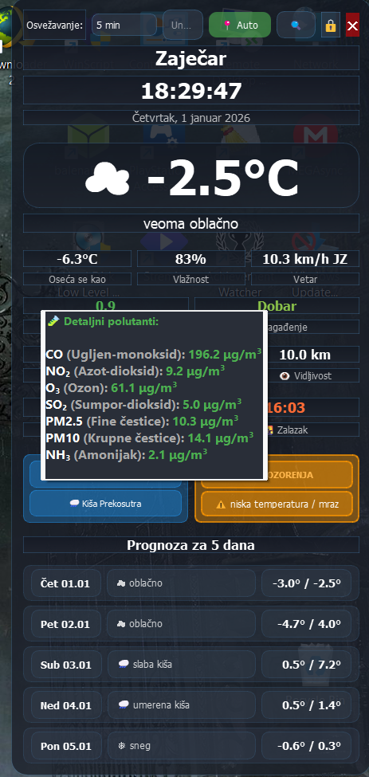
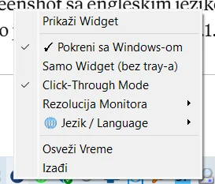
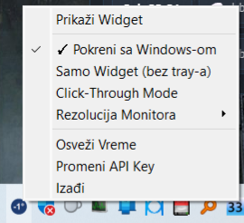

# 🌤️ Desktop Weather Widget

[](https://www.python.org/downloads/)
[](LICENSE)
[](https://github.com/malkosvetnik/desktop-weather-widget/stargazers)
[](https://www.microsoft.com/windows)

A beautiful, feature-rich desktop weather widget for Windows with **15-minute precision nowcast**, real-time weather updates, and bilingual support (Serbian/English).

> **🎯 Better than Microsoft's built-in weather widget!**



*Desktop weather widget with bilingual support and 15-minute nowcast precision*

---

## 🎊 What's New in v2.1.6

### ⚡ **15-Minute Nowcast** - NEW!
The game-changer feature that sets this widget apart:

- **🎯 Radar-like precision**: See rain coming 15, 30, 45 minutes ahead
- **📍 Minutely forecasts**: 8 intervals × 15min = 2-hour nowcast window
- **💧 Smart detection**: Distinguishes between rain, snow, and storms
- **🔔 Proactive alerts**: "Rain in 45 min (70%)" gives you time to react

**Example alerts:**
```
⚡ IMMEDIATE (0-2h):   "Rain in 45 min (70%)"
📊 SHORT-TERM (2-24h): "Rain in 6h (55%)"
```

### 🧠 4-Layer Priority System
Intelligently prioritizes weather data:

1. **Current conditions** → "Rain NOW!" (when actively raining)
2. **Weather code validation** → Confirms precipitation type
3. **Minutely nowcast (0-2h)** → 15-minute precision alerts
4. **Hourly forecast (2-24h)** → Long-term planning

---

## ✨ Features

### 🌡️ Current Weather
- Real-time temperature and "feels like" temperature
- Weather description with emoji icons
- Humidity, wind speed & direction
- Atmospheric pressure
- Cloud cover percentage
- Visibility distance

### 🌧️ Precipitation Alerts
- **🆕 15-minute nowcast** (v2.1.6): "Rain in 45 min (70%)"
- **Real-time detection**: Shows "Rain NOW!" when it's actively raining
- **Smart forecasting**: Accurate timing for upcoming rain, snow, or storms
- **Intelligent rounding**: 1h 56min shows as "2h" (not "1h")
- Supports rain, snow, and thunderstorms

### 📊 Additional Information
- **UV Index** with color-coded severity
- **Air Quality Index (AQI)** with detailed pollutant breakdown tooltip
- **5-Day Forecast** with min/max temperatures
- **Hourly Forecast** (12h) - click on "SATNA PROGNOZA" box to see detailed tooltip
- **Sunrise & Sunset** times

### 🎨 Customization
- **Bilingual**: Serbian (Latin) and English
- **Auto-location** or manual city selection
- **Adjustable refresh intervals**: 5, 10, 15, 30, or 60 minutes
- **Resolution presets**: From XGA (1024x768) to 8K UHD
- **Click-through mode**: Widget becomes transparent to clicks
- **Position locking**: Prevent accidental movement
- **System tray integration**: Minimize to tray

### 🛌 Advanced Features
- **Sleep mode detection**: Automatically refreshes after system wake
- **Hibernate support**: Works after full system shutdown/restore
- **Network retry logic**: 3 attempts with 15s delays
- **Graceful degradation**: Falls back elegantly if API data missing
- **Startup with Windows**: Optional auto-start
- **Persistent settings**: Remembers your preferences

---

## 📥 Installation

### Option 1: Run from Source
1. Install Python 3.8+ and dependencies:
   ```bash
   pip install PyQt5 requests
   ```

2. Download `weather_widget.pyw`

3. **No API key required!** Uses free Open-Meteo API

4. Run the widget:
   ```bash
   python weather_widget.pyw
   ```

### Option 2: Download Compiled .exe (Coming Soon!)
No Python installation required - just download and run!

---

## 🎮 Usage

### Basic Controls
- **Drag widget**: Click and drag anywhere to move (when unlocked)
- **🔒 Lock button**: Lock/unlock position
- **📍 Auto button**: Toggle automatic location detection
- **Search box**: Manually enter city name
- **✕ Close**: Hide widget (still runs in tray)

### Tray Menu
Right-click the tray icon for:
- Show/Hide widget
- Enable/disable startup with Windows
- Widget-only mode (no tray icon)
- Click-through mode
- Resolution presets
- Refresh weather
- Language selection (Serbian/English)
- Exit application

### Tooltips
- **Hover over Air Quality (Zagađenje)**: See detailed pollutant breakdown
- **Click on SATNA PROGNOZA box**: View 12-hour forecast table
- **Hover over precipitation alert**: See detailed nowcast timeline

---

## 🆕 What's New - Version History

### v2.1.6 (January 9, 2026) - NOWCAST UPDATE 🎊

#### 🚀 New Features
- **15-minute precision nowcast** using `minutely_15` API
- **4-layer priority system** for intelligent weather alerts
- **Time-aware parsing**: Always shows future intervals (skips past)
- **Snow vs rain detection**: Accurately distinguishes precipitation type
- **Graceful API fallback**: Works even with incomplete data

#### 🐛 Bug Fixes
- Fixed minutely forecast time parsing (now correctly identifies future intervals)
- Fixed precipitation type detection (snow vs rain)
- Fixed edge cases at midnight rollover
- Improved sleep/wake cycle handling

#### 🔧 Technical Improvements
- Smart interval selection (finds first future 15-min block)
- Better error recovery and logging
- Optimized API requests (only fetches needed data)
- Enhanced tooltip formatting for nowcast display

### v2.1.0 (January 5, 2026)
- Full English language support
- Real-time precipitation detection ("Rain NOW!")
- Improved time calculation (proper rounding)
- Fixed translation issues
- Better API data completeness

### v2.0.0 (Initial Public Release)
- Complete weather widget with all core features
- Serbian language support
- Sleep mode detection
- System tray integration

---

## 📸 Screenshots

### Main Widget - English


### Main Widget - Serbian


### Precipitation Alert - Rain NOW


### 15-Minute Nowcast (NEW in v2.1.6!)
*Coming soon - screenshot of minutely forecast tooltip*

### Hourly Forecast Tooltip


### Air Quality Tooltip


### Language Menu


### Tray Menu


---

## 🔧 Requirements

- **Python**: 3.8 or higher
- **PyQt5**: 5.15+
- **requests**: 2.25+
- **No API key required!** (uses free Open-Meteo API)

---

## 📝 Configuration

Settings are automatically saved in Windows Registry under:
```
HKEY_CURRENT_USER\Software\WeatherWidget\Settings
```

Stored settings:
- Window position
- Lock status
- Click-through mode
- Language preference
- Refresh interval
- Resolution preset
- Startup mode

---

## 🌐 API Information

This widget uses **100% free APIs** with no registration required:

- **Open-Meteo Weather API** (free, no key required)
  - Current weather, forecasts, UV index
  - **Minutely 15-min forecasts** (nowcast)
  - Hourly and daily forecasts
  - https://open-meteo.com

- **Open-Meteo Air Quality API** (free)
  - AQI and pollutant data
  - https://open-meteo.com/en/docs/air-quality-api

---

## 🤝 Contributing

Contributions are welcome! Please feel free to submit a Pull Request.

### Development Setup
```bash
git clone https://github.com/malkosvetnik/desktop-weather-widget.git
cd desktop-weather-widget
pip install -r requirements.txt
python weather_widget.pyw
```

### Testing Checklist
- [ ] Test on Windows 10 and 11
- [ ] Test sleep/wake cycle
- [ ] Test hibernate recovery
- [ ] Test network disconnection
- [ ] Test both languages (Serbian/English)
- [ ] Test all resolution presets
- [ ] Test multi-monitor setup

---

## 🐛 Known Issues & Troubleshooting

### Widget doesn't refresh after sleep
- Solution: Widget has built-in 30s delay after wake - this is intentional to wait for network

### Nowcast shows no data
- Solution: Minutely forecasts are only available for some regions - widget gracefully falls back to hourly

### High DPI scaling issues
- Solution: Use resolution presets from tray menu to match your display

### Report other issues
- Open an issue: https://github.com/malkosvetnik/desktop-weather-widget/issues

---

## 📜 License

This project is open source and available under the MIT License.

---

## 🙏 Credits

- Weather data: [Open-Meteo](https://open-meteo.com)
- Icons: Unicode emoji
- Framework: PyQt5
- Developed with ❤️ and lots of ☕

---

## 📞 Support

Found a bug or have a suggestion?
- Open an issue: https://github.com/malkosvetnik/desktop-weather-widget/issues
- Check existing issues first!
- Star ⭐ the repo if you find it useful!

---

## 🗺️ Roadmap

### Upcoming Features
- [ ] Desktop notifications (Windows toast)
- [ ] Customizable themes (dark/light/auto)
- [ ] More language options (German, French, Spanish)
- [ ] Widget size presets (small/medium/large)
- [ ] Multiple location tracking
- [ ] Weather radar integration
- [ ] Severe weather alerts

### Long-term Goals
- [ ] Microsoft Store release
- [ ] macOS/Linux support
- [ ] Mobile companion app
- [ ] Smart home integration

---

## 🌟 Why This Widget?

### vs. Microsoft Weather Widget
✅ **15-minute nowcast** (Microsoft: hourly only)  
✅ **Always visible on desktop** (Microsoft: hidden in sidebar)  
✅ **Bilingual support** (Microsoft: system language only)  
✅ **No telemetry** (Microsoft: tracks usage)  
✅ **Fully customizable** (Microsoft: limited options)  
✅ **Open source** (Microsoft: closed)

### vs. Rainmeter
✅ **Simpler to use** (no skin configuration needed)  
✅ **Lower resource usage** (Python vs Rainmeter engine)  
✅ **Better precipitation alerts** (smart 4-layer system)  
✅ **Built-in sleep mode handling** (Rainmeter skins often break)

### vs. Web-based Widgets
✅ **No browser required** (native desktop app)  
✅ **Works offline** (shows last cached data)  
✅ **Lower latency** (direct API calls)  
✅ **Privacy-focused** (no tracking scripts)

---

**Made with ❤️ by [malkosvetnik](https://github.com/malkosvetnik)**

*If you find this widget useful, please consider starring ⭐ the repository!*
