# 🌤️ Desktop Weather Widget v2.2.3

**Elegant, minimalist desktop weather widget with Windows Location support, multi-language localization, and advanced features.**

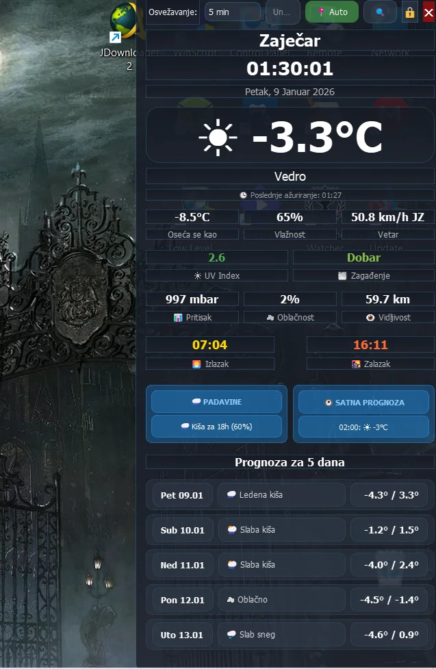

---

## ✨ Key Features

### 🌍 **Location**
- 🔄 **API Auto-detection** (IP geolocation)
- 📍 **Windows Location API** (GPS/Wi-Fi triangulation)
- 🔍 **Manual search** for cities worldwide
- 🌐 **Reverse geocoding** for city name display

### 🌡️ **Weather Data**
- 🌤️ **Current weather** with detailed data
- 📊 **5-day forecast** (min/max temperature)
- 🕐 **Hourly forecast** for the next 12 hours (tooltip)
- 🌧️ **Precipitation** with precise predictions (minutely_15)
- 🌫️ **Air quality** (European AQI) with detailed pollutants
- ☀️ **UV Index** with color coding by level
- 👁️ **Visibility**, pressure, cloudiness, wind with direction
- 🌅 **Sunrise/sunset** times

### 🌐 **Localization**
- 🇷🇸 **Serbian** (Latin + Cyrillic)
- 🇬🇧 **English**
- 🔤 **Automatic conversion** from Cyrillic to Latin
- 📅 **Localized dates** and days of the week

### ⚙️ **Settings**
- 🌡️ **Celsius / Fahrenheit** (independent from others)
- 🕐 **12h / 24h** time format
- 📏 **Metric / Imperial** units (wind, pressure, visibility)
- 📍 **API / Windows Location** sources
- 🔄 **Refresh interval** (5min, 10min, 15min, 30min, 60min)
- 📐 **Monitor resolution** (8 presets: XGA → 8K UHD)

### 🎨 **UI/UX**
- 🔒 **Lock/Unlock** widget position
- 👻 **Click-Through Mode** (mouse transparency)
- 🖥️ **Widget-only Mode** (without tray icon)
- 🚀 **Auto-start** with Windows
- 🔋 **Battery status** (laptops only)
- 🕐 **Live clock** with seconds
- 💡 **Tooltips** with detailed data
- 🌙 **Dark theme** with semi-transparent backgrounds

---

## 📸 Screenshots

### 🇷🇸 Serbian Language

*Main display with all data*

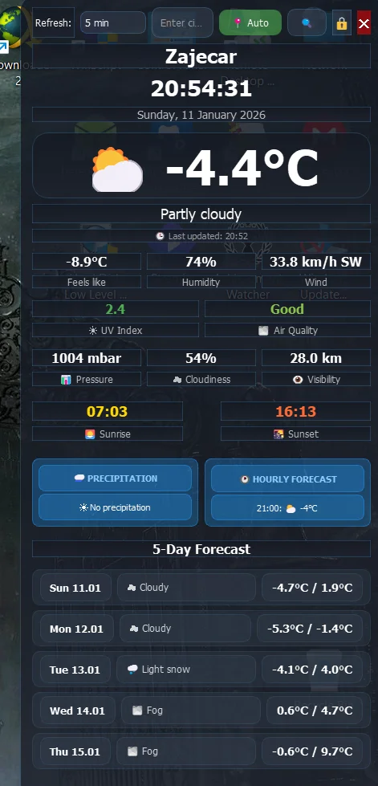
*24-hour time format*

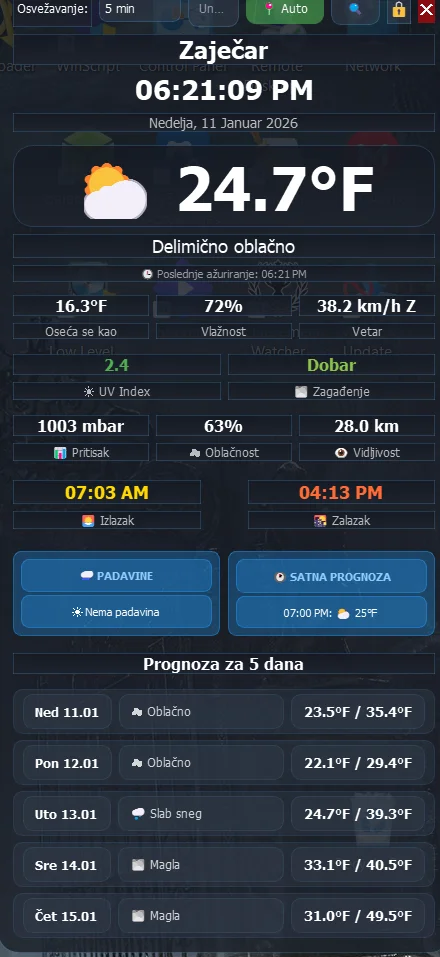
*Celsius temperature (default)*

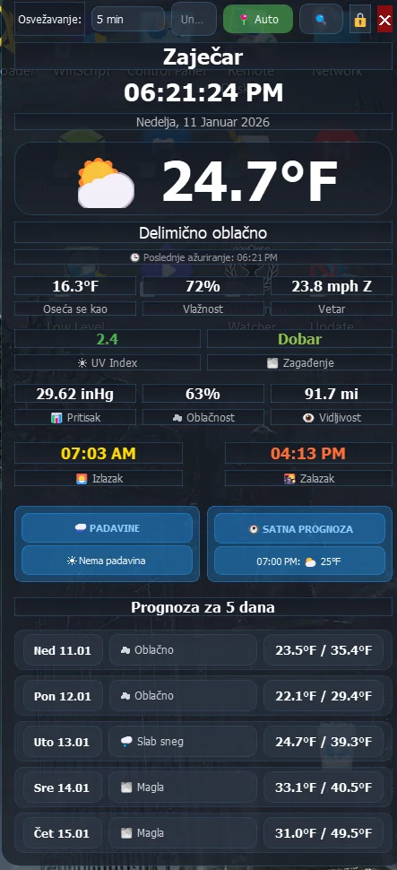
*Fahrenheit temperature*

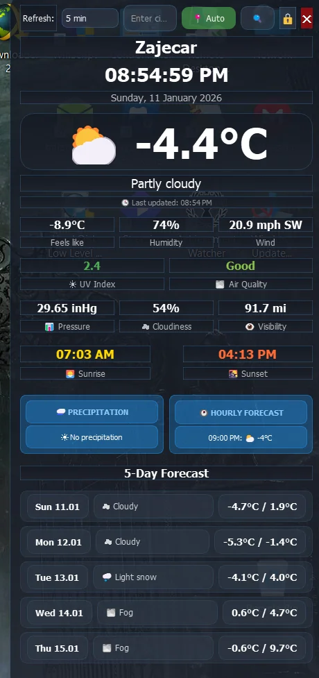
*Imperial units (mph, inHg)*

### 🇬🇧 English Language

*English language interface*

### 📊 Tooltips

*Hourly forecast for 12 hours with tooltip*

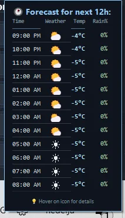
*Hourly forecast in 12h format*

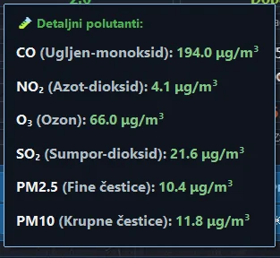
*Detailed air pollutants*


*Precipitation warning*

### ⚙️ Menus
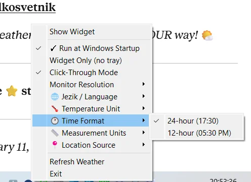
*Complete tray menu*


*Standard tray menu*

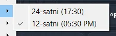
*Tray menu in English*


*Language selection*

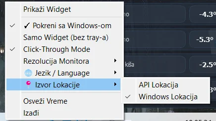
*Location source menu (Serbian)*

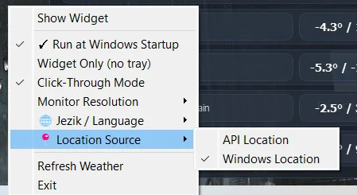
*Location source menu (English)*

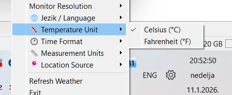
*Temperature unit selection*

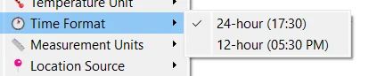
*Time format selection*

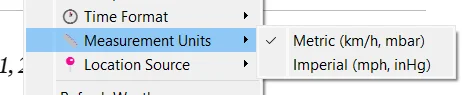
*Unit system selection*

---

## 🚀 Installation

### Prerequisite: Python 3.8+

```bash
# Check Python version
python --version
```

### Installing dependencies

```bash
pip install -r requirements.txt
```

**requirements.txt:**
```
PyQt5>=5.15.0
requests>=2.25.0
psutil>=5.8.0
```

### Running

```bash
python weather_widget_final.pyw
```

---

## 🔧 Configuration

### Windows Location Setup

To use Windows Location API:

1. Open **Settings** (⊞ Win + I)
2. Go to **Privacy & Security → Location**
3. Turn ON **Location services**
4. Enable **Let apps access your location**

Widget will automatically detect Windows Location status.

### Auto-start with Windows

Right-click on tray icon → **✓ Start with Windows**

Widget will add entry to Windows Registry:
```
HKEY_CURRENT_USER\Software\Microsoft\Windows\CurrentVersion\Run
```

---

## 📋 Changelog - v2.2.3 (2025-01-12)

### 🔥 **CRITICAL CHANGES:**

#### ✅ **Windows Location FIX**
- **Problem:** `geocoder.windows()` method doesn't exist → fell back to IP geolocation
- **Solution:** Implemented **PowerShell + .NET System.Device.Location API**
- **Result:** 100% real Windows Location with GPS/Wi-Fi triangulation
- **Accuracy:** Displays location precision in meters
- **No dependencies:** No need for `geocoder` library

**Details:**
```python
# Old code (DOESN'T WORK):
import geocoder
g = geocoder.windows('me')  # ❌ Doesn't exist!

# New code (WORKS):
PowerShell → .NET System.Device.Location API → JSON → Python
```

**Output:**
```
🔍 Attempting to get Windows Location (PowerShell)...
✅ Windows Location successful: (43.9134, 22.2777)
   Accuracy: 106m
✅ Windows Location: Zaječar (43.9134, 22.2777)
```

### 🌐 **Multi-language support:**
- 🇷🇸 Serbian (Latin)
- 🇬🇧 English
- ✅ All labels, menus, tooltips, warnings localized
- ✅ Automatic conversion from Cyrillic to Latin

### 🌡️ **Temperature & Unit System:**
- ✅ Independent **Celsius/Fahrenheit** selection for temperature
- ✅ **Metric/Imperial** for other units (wind, pressure, visibility)
- ✅ Consistency between API calls and display

### 🕐 **Time Format:**
- ✅ 12-hour format with AM/PM
- ✅ 24-hour format
- ✅ Localized dates (Monday vs Ponedeljak)

### 🔋 **Battery Status:**
- ✅ Displays only on laptops
- ✅ Different icons: 🔌 (charging), 🔋 (full), 🪫 (low/critical)
- ✅ Dynamic colors (green/white/orange/red)
- ✅ Real-time updates every 5 seconds

### 🌧️ **Precipitation:**
- ✅ Minutely_15 forecast (0-2h) for precision
- ✅ "Rain NOW!" / "Snow NOW!" warnings
- ✅ Predictions with "Rain in 15min" / "Snow in 15min"
- ✅ Precise weather codes (71-77 = snow, rest = rain)

### 🕐 **Hourly forecast:**
- ✅ Shows NEXT hour (current skipped)
- ✅ Tooltip with 12 future hours
- ✅ Icon, temperature, precipitation probability
- ✅ Automatic detection of precipitation type (rain/snow)

### 🌫️ **Air Quality:**
- ✅ European AQI standard
- ✅ Categories: Excellent/Good/Moderate/Poor/Very Poor
- ✅ Tooltip with details: PM10, PM2.5, CO, NO₂, SO₂, O₃
- ✅ Dynamic colors by AQI level

### 🔄 **Sleep/Wake detection:**
- ✅ Detects laptop sleep/hibernate
- ✅ Waits 30s before first refresh after wake
- ✅ Exponential backoff if network not ready
- ✅ Doesn't destroy last data during offline period

### 🎨 **UI Improvements:**
- ✅ Consistent colors and font sizes
- ✅ Transparent backgrounds for all labels
- ✅ Clickable labels with hover effects for tooltips
- ✅ Dark tooltip theme

---

## 🐛 Bug Fixes

### v2.2.3:
- ✅ **CRITICAL:** Windows Location now works (PowerShell implementation)
- ✅ JSON parsing with regex fallback for PowerShell whitespace
- ✅ Visibility API consistency (always km, conversion to mi later)
- ✅ Precipitation API consistency (always mm, conversion to in later)
- ✅ Wind speed API consistency (m/s → km/h → mph)
- ✅ Automatic fallback to API location if Windows Location unavailable

### v2.2.2:
- ✅ Visibility data now from `current` block (not from `hourly`)
- ✅ Pressure consistency between Metric/Imperial
- ✅ Temperature_unit parameter in API call

### v2.2.1:
- ✅ Precipitation unit consistency
- ✅ Wind speed unit consistency

### v2.2.0:
- ✅ Click-through mode with Windows API transparent flag
- ✅ Widget-only mode with tray-removal option

---

## 🛠️ Technical Details

### APIs used:
- **Weather:** [Open-Meteo](https://open-meteo.com/) (free, no API key)
- **Air Quality:** [Open-Meteo Air Quality API](https://open-meteo.com/en/docs/air-quality-api)
- **Geocoding:** [Open-Meteo Geocoding API](https://open-meteo.com/en/docs/geocoding-api)
- **Reverse Geocoding:** [OpenStreetMap Nominatim](https://nominatim.openstreetmap.org/)
- **IP Geolocation:** [ip-api.com](http://ip-api.com/)
- **Windows Location:** .NET System.Device.Location (via PowerShell)

### Architecture:
- **Framework:** PyQt5
- **Language:** Python 3.8+
- **Settings:** QSettings (persistent storage)
- **Networking:** requests library with retry logic
- **Sleep detection:** Timer-based with exponential backoff

### Performance:
- **Refresh rate:** 5-60 minutes (configurable)
- **Battery update:** Every 5 seconds (laptop only)
- **Clock update:** Every second
- **Memory footprint:** ~50-70 MB
- **CPU usage:** <1% (idle), ~5% (refresh)

---

## 📝 License

MIT License - free to use, modify, and distribute.

---

## 🤝 Contributing

Pull requests are welcome! For major changes, please open an issue first to discuss what you'd like to change.

### Development setup:

```bash
# Clone repo
git clone https://github.com/malkosvetnik/Desktop-Weather-Widget.git
cd Desktop-Weather-Widget

# Install dependencies
pip install -r requirements.txt

# Run
python weather_widget_final.pyw
```

---

## 🙏 Acknowledgments

- [Open-Meteo](https://open-meteo.com/) for excellent free Weather API
- [OpenStreetMap Nominatim](https://nominatim.openstreetmap.org/) for reverse geocoding
- PyQt5 community for excellent documentation
- All testers and contributors!

---

## 📞 Contact

- **GitHub:** [@malkosvetnik](https://github.com/malkosvetnik)
- **Project:** [Desktop Weather Widget](https://github.com/malkosvetnik/Desktop-Weather-Widget)

---

## 🔮 Planned Features

- [ ] Skin system with custom design support
- [ ] Widget resize with drag-and-drop
- [ ] Multiple API providers (AccuWeather, WeatherAPI)
- [ ] Notifications for extreme weather
- [ ] Weather history with graphs
- [ ] Export data to CSV/JSON

---

**Enjoy the widget! 🌤️**

---

*Version: 2.2.3 | Released: January 12, 2026*
